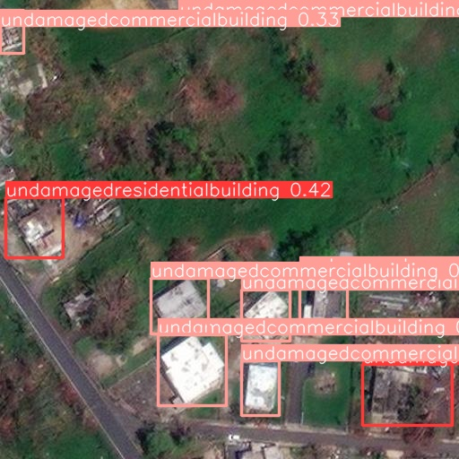

# Satellite Object Detection with YOLOv8

## Introduction
In the aftermath of a catastrophe, the utilization of multiple satellite images captured over time can significantly aid in the identification of affected areas. This challenge is focused on employing image object detection techniques to identify damaged residential and commercial buildings. Leveraging an unlabeled dataset generously provided by EY, we  labeled 70 images and employed various data augmentation techniques such as rotation and brightness adjustment. We utilized these annotated images to train YOLOv8 models, enabling the detection of damaged buildings and the classification into four distinct classes:

**CLASSES:** 
- `"undamagedresidentialbuilding"`
- `"undamagedcommercialbuilding"`
- `"damagedresidentialbuilding"`
- `"damagedcommercialbuilding"` 

This endeavor represents a crucial step forward in disaster response and recovery efforts, facilitating the rapid assessment of affected areas and the prioritization of rescue and rebuilding operations.

  

## How to Recompute

To recompute the project, follow these steps:

1. **Training with Labeled Pictures:**
   
   Utilize the main file to conduct training exclusively with the labeled pictures. This file contains the necessary scripts and configurations to initiate the training process using the provided dataset. (You can start from scratch using the EY_notebook)

2. **Data Augmentation:**
   
    Execute the data_augmentation file to apply data augmentation techniques to the dataset. This file contains functions and methods specifically designed to preprocess the images using augmentation methods such as rotation, brightness adjustment, etc.

## Objective
The primary objective of this project is to create a Tropical storm damage detection model.

  

## Pipeline
The pipeline for this project involves the following steps:

1. **Data Preprocessing and Augmentation:** Using multiple images taken over time from satellites, we structured and cleaned the dataset provided by EY. We labeled 70 pictures and applied data augmentation techniques such as rotation and brightness adjustment to enhance the diversity of our dataset.

2. **Model Training:** We trained YOLOv8 models using the labeled images to detect harmed buildings and classify them into the four specified classes.

3. **Result Generation:** After training the models, we utilized them to generate results and identify damaged residential and commercial buildings in the satellite images.

### Team:
- AL BOUZIDI ELIAS: CentraleSupélec
- BEN LETAIFA Idriss: CentraleSupélec
- SLIMANE Meriame: Université Paris Dauphine-PSL
- REKAYA Hamza: Télécom Paris
